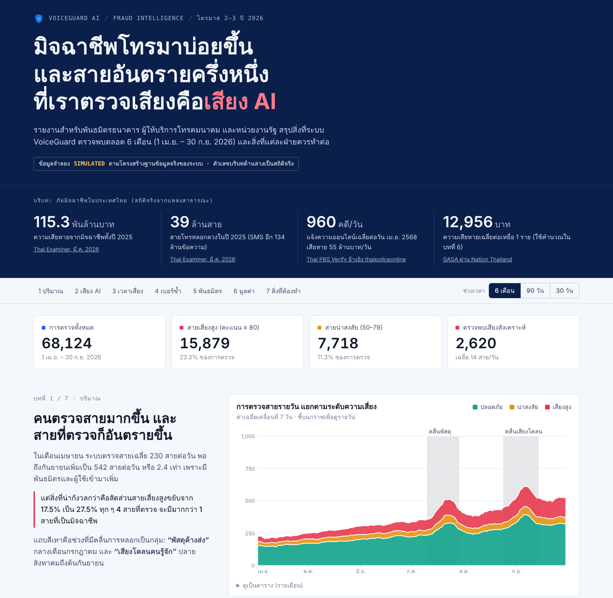
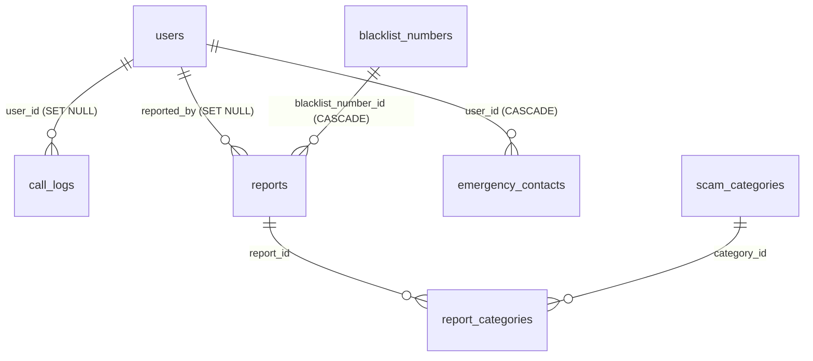

# VoiceGuard Threat Report: Storytelling Dashboard

> **มิจฉาชีพโทรมาบ่อยขึ้น และสายอันตรายครึ่งหนึ่งที่เราตรวจเสียงคือเสียง AI**
> Dashboard เชิงเล่าเรื่อง (data storytelling) ของระบบ **VoiceGuard AI** สำหรับพันธมิตรธนาคาร ผู้ให้บริการโทรคมนาคม (Telco) และหน่วยงานรัฐ
> สรุปสิ่งที่ระบบตรวจพบตลอด 6 เดือน (1 เม.ย. – 30 ก.ย. 2026) และสิ่งที่แต่ละฝ่ายควรทำต่อ



| | |
|---|---|
| **เปิดดูออนไลน์** | https://praweejarujit.github.io/DetectCallcenter/ (ใช้ได้หลังเปิด GitHub Pages ตาม[หัวข้อที่ 9](#9-การเผยแพร่บน-github-pages)) |
| **เปิดในเครื่อง** | ดับเบิลคลิก [`index.html`](index.html) (ไฟล์เดียว ไม่ต้องติดตั้งหรือรันเซิร์ฟเวอร์) |
| **ภาพทั้งหน้า** | [`docs/full-page.png`](docs/full-page.png) · มือถือโหมดมืด [`docs/preview-mobile-dark.png`](docs/preview-mobile-dark.png) |
| **ส่วนหนึ่งของ** | โปรเจกต์ [DetectCallcenter / VoiceGuard AI](../README.md) (BUU) |

---

## สารบัญ

1. [ภาพรวมและกลุ่มผู้อ่าน](#1-ภาพรวมและกลุ่มผู้อ่าน)
2. [โครงเรื่อง 7 บท และข้อค้นพบ](#2-โครงเรื่อง-7-บท-และข้อค้นพบ)
3. [กราฟแต่ละตัว: อ่านอย่างไร คำนวณอย่างไร](#3-กราฟแต่ละตัว-อ่านอย่างไร-คำนวณอย่างไร)
4. [ข้อมูลที่ใช้ (Data)](#4-ข้อมูลที่ใช้-data)
5. [Data dictionary: ข้อมูลดิบ](#5-data-dictionary-ข้อมูลดิบ-dataraw)
6. [Data dictionary: ตารางสรุป](#6-data-dictionary-ตารางสรุป-dataaggregated)
7. [วิธีสร้างข้อมูลจำลองและสมมติฐาน](#7-วิธีสร้างข้อมูลจำลองและสมมติฐาน)
8. [สร้างใหม่ / โหลดเข้า PostgreSQL / ใช้ SQL](#8-สร้างใหม่--โหลดเข้า-postgresql--ใช้-sql)
9. [การเผยแพร่บน GitHub Pages](#9-การเผยแพร่บน-github-pages)
10. [โครงสร้างไฟล์ทั้งหมด](#10-โครงสร้างไฟล์ทั้งหมด)
11. [การออกแบบและเทคนิค](#11-การออกแบบและเทคนิค)
12. [ข้อจำกัด](#12-ข้อจำกัด)
13. [แหล่งอ้างอิง](#13-แหล่งอ้างอิง)

---

## 1. ภาพรวมและกลุ่มผู้อ่าน

| หัวข้อ | รายละเอียด |
|---|---|
| ผู้อ่าน | เจ้าหน้าที่พันธมิตรที่ใช้ระบบ ตรงกับ `UserRole` ใน backend: `bank` ธนาคาร, `telco` ผู้ให้บริการโทรคมนาคม, `gov` หน่วยงานรัฐ |
| หน้าที่ของ dashboard | บอกว่าภัยเปลี่ยนไปอย่างไร ควรโฟกัสตรงไหน และการแจ้งเบาะแสของพันธมิตรช่วยได้แค่ไหน |
| ช่วงข้อมูล | 1 เม.ย. 2026 – 30 ก.ย. 2026 (183 วัน) เวลาไทย (UTC+07:00) |
| ขนาดข้อมูล | ตรวจสาย 68,124 ครั้ง · เบอร์ blacklist 1,654 เบอร์ · แจ้งเบาะแส 4,019 ครั้ง · บัญชีพันธมิตร 35 บัญชี |
| ประเภทข้อมูล | ข้อมูลระบบ (บท 1–6) **จำลอง** ตามโครงสร้างตารางจริง · แถบบริบทด้านบน **สถิติจริง** ของประเทศไทยพร้อมแหล่งอ้างอิง |

### ส่วนประกอบของหน้า (เรียงจากบนลงล่าง)

1. **หัวเรื่อง (headline)** บอกข้อสรุปหลักของรายงานในประโยคเดียว พร้อมป้าย `SIMULATED`
2. **แถบบริบท (สถิติจริง)** 4 ตัวเลขของภัยมิจฉาชีพในไทย ให้ผู้อ่านเห็นขนาดของปัญหาก่อนดูข้อมูลระบบ
3. **แถบควบคุม (ติดหน้าจอขณะเลื่อน)** เมนูไปยังบทต่าง ๆ และตัวกรองช่วงเวลา `6 เดือน / 90 วัน / 30 วัน`
4. **KPI 4 ช่อง** การตรวจทั้งหมด · สายเสี่ยงสูง · สายน่าสงสัย · เสียงสังเคราะห์ (เมื่อเลือก 90/30 วัน จะแสดง % เปลี่ยนแปลงเทียบช่วงก่อนหน้าเท่ากัน)
5. **7 บท** แต่ละบทมีคอลัมน์เล่าเรื่องด้านซ้าย (หัวข้อ → ข้อความ → ประเด็นเน้น → “หมายความว่า”) และหลักฐาน (กราฟ/ตาราง) ด้านขวา
6. **ท้ายหน้า** ข้อมูลที่ใช้และแหล่งอ้างอิง

ตัวกรองช่วงเวลามีผลกับ: KPI, กราฟรายวัน (บทที่ 1) และมูลค่าประมาณการ (บทที่ 6) · กราฟอื่นแสดงทั้ง 6 เดือนเสมอ เพราะเล่าการเปลี่ยนแปลงระหว่างเดือน

---

## 2. โครงเรื่อง 7 บท และข้อค้นพบ

| บท | หัวข้อบนหน้า | คำถามที่ตอบ | ข้อค้นพบ (ตัวเลขจากข้อมูล) |
|---|---|---|---|
| 1 | คนตรวจสายมากขึ้น และสายที่ตรวจก็อันตรายขึ้น | ภัยมากขึ้นไหม | การตรวจเฉลี่ย 230 → 542 สาย/วัน (2.4 เท่า) · สัดส่วนสายเสี่ยงสูง 17.5% → 27.5% |
| 2 | เสียงที่คุณได้ยิน อาจไม่ใช่คนจริง | อันตรายแบบไหนโตเร็วที่สุด | เสียงสังเคราะห์ในสายเสี่ยงสูง (ที่วิเคราะห์เสียง) 16.1% → 50.8% · “เสียงโคลน” อันดับ 5 → 1 (49 → 252 ครั้ง/เดือน, 5.1 เท่า) |
| 3 | มิจฉาชีพทำงานตามเวลาราชการ | โทรมาเมื่อไหร่ | 66.2% ของสายเสี่ยงสูงเกิด จ.–ศ. 09–17 น. · พีค 10:00 และ 14:00 น. · เสาร์–อาทิตย์รวม 14.7% |
| 4 | เบอร์เพียง 10% ก่อเหตุกว่าครึ่ง | ควรปิดเบอร์ไหนก่อน | 187 เบอร์แรก (10% ของ 1,726 เบอร์) ก่อสายเสี่ยงสูง 51.4% · Top 10 ใช้งานเฉลี่ย 29.5 วัน · เบอร์ 02 ปลอมเป็นองค์กร 7.8% |
| 5 | ยิ่งมีคนช่วยแจ้ง ยิ่งปิดเบอร์ได้เร็ว | การแจ้งเบาะแสช่วยไหม | บัญชีพันธมิตร 12 → 35 · แจ้ง 482 → 894 ครั้ง/เดือน · เวลาถึง blacklist (มัธยฐาน) 44.6 → 14.3 ชม. (เร็วขึ้น 3.1 เท่า) |
| 6 | เงินที่ไม่ต้องสูญเสีย | คุ้มค่าแค่ไหน | ประมาณการ ฿4.1 ล้าน (6 เดือน, สมมติฐาน 2%) · ผู้อ่านปรับสมมติฐาน 0.5–5% ได้ |
| 7 | ข้อเสนอสำหรับไตรมาสถัดไป | ทำอะไรต่อ | ธนาคาร: หน่วงการโอนหลังรับสายเสี่ยงสูง · Telco: ระงับเบอร์หัวแถว + ติดป้ายเบอร์ 02 ปลอม · รัฐ: เปลี่ยนข้อความรณรงค์เป็นเรื่องเสียงโคลน และเก็บข้อมูลผลลัพธ์หลังเตือน |

> ข้อความบรรยายในบทที่ 1–5 **คำนวณจากข้อมูลตอนเปิดหน้า** (ไม่ได้พิมพ์ตัวเลขตายตัว) ถ้าสร้างข้อมูลใหม่ ข้อความจะเปลี่ยนตามเอง

### ตัวเลขรายเดือน (จาก `data/aggregated/monthly_kpi.csv`)

| เดือน | ตรวจ | เสี่ยงสูง | % เสี่ยงสูง | น่าสงสัย | เสียง AI | % เสียง AI ในสายเสี่ยงสูง* | เบอร์ใหม่ | แจ้งเบาะแส | ชม. ถึง blacklist (มัธยฐาน / P75) |
|---|---:|---:|---:|---:|---:|---:|---:|---:|---:|
| เม.ย. | 6,901 | 1,211 | 17.5 | 877 | 103 | 16.1 | 267 | 482 | 44.6 / 65.8 |
| พ.ค. | 8,560 | 1,671 | 19.5 | 1,102 | 165 | 20.2 | 240 | 541 | 41.8 / 58.9 |
| มิ.ย. | 9,777 | 2,036 | 20.8 | 1,160 | 270 | 26.4 | 243 | 578 | 31.7 / 44.8 |
| ก.ค. | 13,176 | 3,133 | 23.8 | 1,498 | 475 | 32.2 | 295 | 737 | 28.8 / 41.0 |
| ส.ค. | 13,460 | 3,356 | 24.9 | 1,432 | 565 | 35.0 | 305 | 787 | 20.7 / 30.3 |
| ก.ย. | 16,250 | 4,472 | 27.5 | 1,649 | 1,042 | 50.8 | 304 | 894 | 14.3 / 20.3 |
| **รวม** | **68,124** | **15,879** | **23.3** | **7,718** | **2,620** | | | **4,019** | |

\* นับเฉพาะสายเสี่ยงสูงที่มาจาก `source` = `audio` หรือ `demo` เพราะการตรวจแบบ `number_check` ไม่มีไฟล์เสียงให้วิเคราะห์

---

## 3. กราฟแต่ละตัว: อ่านอย่างไร คำนวณอย่างไร

| บท | กราฟ | ชนิด | ข้อมูล | วิธีคำนวณ | การโต้ตอบ |
|---|---|---|---|---|---|
| — | KPI 4 ช่อง | ตัวเลข | `daily_calls` | รวมค่ารายวันในช่วงที่เลือก · % เปลี่ยนแปลง = เทียบช่วงก่อนหน้าที่ยาวเท่ากัน (สัดส่วนสายเสี่ยงสูงแสดงเป็น “จุด %”) | เปลี่ยนตามตัวกรองช่วงเวลา |
| 1 | การตรวจสายรายวันแยกระดับความเสี่ยง | Stacked area | `daily_calls` | ค่าเฉลี่ยเคลื่อนที่ 7 วันของ safe / suspect / high_risk · แถบเทาคือช่วงคลื่นการหลอก | ชี้ดูค่าจริงรายวัน · ตัวกรองช่วงเวลา · กดดูตารางรายเดือน |
| 2 | สัดส่วนเสียง AI ในสายเสี่ยงสูง | Column | `monthly_kpi` | สายเสี่ยงสูงที่ `is_synthetic_voice` = true ÷ สายเสี่ยงสูงที่ `source` ≠ `number_check` | ชี้ดูค่า |
| 2 | อันดับรูปแบบการหลอก เม.ย. → ก.ย. | Slope chart | `category_monthly` | นับ `report_categories` ต่อหมวดต่อเดือน แล้วจัดอันดับ · เน้นสีเฉพาะ “เสียงโคลน” | — |
| 3 | สายเสี่ยงสูงแยกวัน × ชั่วโมง | Heatmap 7 × 24 | `heatmap_weekday_hour` | นับสายเสี่ยงสูงทั้ง 6 เดือนต่อช่อง · สีแบ่ง 5 ระดับเทียบช่องสูงสุด | ชี้ดูจำนวนและค่าเฉลี่ยต่อสัปดาห์ (÷ 26) |
| 4 | สัดส่วนสายเสี่ยงสูงสะสม | Pareto / Lorenz curve | `pareto_numbers` | เรียงเบอร์ตามจำนวนสายเสี่ยงสูงมาก→น้อย แล้วสะสม % · เส้นทแยง = กรณีทุกเบอร์ก่อเหตุเท่ากัน | ชี้ดู % ของเบอร์ ณ จุดใดก็ได้ |
| 4 | ประเภทเบอร์ที่ใช้โทร | Horizontal bar | `prefix_mix` | จัดกลุ่มสายเสี่ยงสูงตามเลขขึ้นต้น (06x / 08x / 09x / 02) | — |
| 4 | 10 เบอร์ที่ก่อเหตุมากที่สุด | ตาราง + แถบ | `top_numbers` | ปิดเลขกลาง · รูปแบบหลัก = หมวดที่ถูกแจ้งมากที่สุดของเบอร์นั้น · วันใช้งาน = สายสุดท้าย − สายแรก + 1 | — |
| 5 | เวลาจากสายแรกถึงขึ้น Blacklist | Line + band | `monthly_kpi` | `first_reported_at` − สายแรกใน `call_logs` ของเบอร์เดียวกัน · เส้น = มัธยฐาน · แถบจาง = ถึง P75 · จัดกลุ่มตามเดือนที่เห็นเบอร์ครั้งแรก | ชี้ดูมัธยฐาน, P75, จำนวนเบอร์ใหม่ |
| 5 | การแจ้งเบาะแสรายเดือน | Stacked column | `partner_reports_monthly` | นับ `reports` ตาม `users.role` ของผู้แจ้ง (`reported_by` ว่าง = ไม่ระบุ) | ชี้ดูแยกฝ่าย + จำนวนบัญชีพันธมิตร |
| 6 | มูลค่าประมาณการ (ตัวเลขใหญ่ + รายเดือน) | Big number + column | `daily_calls`, `monthly_kpi` | **สายเสี่ยงสูง × อัตราที่จะกลายเป็นเหยื่อ (สมมติ) × ฿12,956** | slider 0.5–5% · ตัวกรองช่วงเวลา (เดือนนอกช่วงจะจางลง) |

### นิยามที่ใช้ทั้ง dashboard

| คำ | นิยาม (ตรงกับ backend) |
|---|---|
| สายเสี่ยงสูง (`high_risk`) | `risk_score` ≥ 80 (`HIGH_RISK_THRESHOLD` ใน `backend/app/models/blacklist_number.py`) |
| สายน่าสงสัย (`suspect`) | 50 ≤ `risk_score` ≤ 79 (`SUSPECT_THRESHOLD`) |
| ปลอดภัย (`safe`) | `risk_score` < 50 |
| เสียงสังเคราะห์ / เสียง AI | `call_logs.is_synthetic_voice` = true |
| การตรวจ 1 ครั้ง | 1 แถวใน `call_logs` (ตรวจเบอร์, วิเคราะห์เสียง หรือหน้า demo) |
| เวลาถึง blacklist | ชั่วโมงจากสายแรกของเบอร์ใน `call_logs` ถึง `blacklist_numbers.first_reported_at` |

---

## 4. ข้อมูลที่ใช้ (Data)

> ⚠️ **ข้อมูลระบบเป็นข้อมูลจำลอง (simulated)** เพราะระบบยังไม่มีผู้ใช้จริง
> สร้างด้วย seed คงที่ (`RNG_SEED = 20261005`) รันกี่ครั้งก็ได้ไฟล์เดิมทุกไบต์ และ **คอลัมน์ตรงกับตารางจริงใน `backend/app/models/` ทุกตาราง** จึงโหลดเข้าฐานข้อมูลของระบบได้ทันที

ข้อมูลมี 3 ชั้น:

| ชั้น | โฟลเดอร์ | คืออะไร | ใช้ทำอะไร |
|---|---|---|---|
| ข้อมูลดิบ | `data/raw/` | 1 ไฟล์ต่อ 1 ตาราง (7 ไฟล์) | ส่งเป็น “Data ที่ใช้” · โหลดเข้า PostgreSQL |
| ตารางสรุป | `data/aggregated/` | 9 ไฟล์ CSV (1 ไฟล์ต่อ 1 กราฟ/กลุ่มกราฟ) + `dashboard_data.json` | ข้อมูลที่ dashboard ใช้จริง · เปิดใน Excel / Power BI ได้ |
| SQL | `sql/queries.sql` | query ที่ให้ผลเดียวกับตารางสรุป | แสดงว่าตัวเลขทุกตัวดึงจากฐานข้อมูลจริงได้ |

### ความสัมพันธ์ของตาราง



`call_logs` กับ `blacklist_numbers` ไม่มี FK ต่อกัน แต่เชื่อมด้วย `phone_number` (แบบเดียวกับที่ `/detect/number` ใช้)

### สถิติของข้อมูลดิบ

| ไฟล์ | แถว | ขนาด | หมายเหตุ |
|---|---:|---:|---|
| `call_logs.csv` | 68,124 | 5.9 MB | ตารางหลักของ dashboard · 45% ไม่มี `user_id` (ผู้ใช้ไม่ login) |
| `blacklist_numbers.csv` | 1,654 | 188 KB | high_risk 1,603 · suspect 51 |
| `reports.csv` | 4,019 | 540 KB | `note` ว่างทั้งหมด |
| `report_categories.csv` | 4,994 | 196 KB | 1 report มี 1–2 หมวด |
| `scam_categories.csv` | 8 | <1 KB | ตรงกับ `DEFAULT_CATEGORIES` ใน backend |
| `users.csv` | 36 | 8 KB | admin 1 + พันธมิตร 35 (ธนาคาร 5 แห่ง, Telco 3, รัฐ 4) · **ไม่มีรหัสผ่าน** |
| `emergency_contacts.csv` | 35 | 8 KB | ไม่ได้ใช้ในกราฟ ใส่ไว้ให้ครบทุกตาราง |

---

## 5. Data dictionary: ข้อมูลดิบ (`data/raw/`)

เวลาทุกคอลัมน์เป็น ISO 8601 พร้อม timezone เช่น `2026-04-10T15:56:37+07:00` · boolean เป็น `true`/`false` · ช่องว่าง = `NULL` · ไฟล์เข้ารหัส UTF-8

### `call_logs.csv` (การตรวจสาย 1 ครั้ง = 1 แถว)

| คอลัมน์ | ชนิด | ความหมาย / ค่าที่เป็นไปได้ |
|---|---|---|
| `id` | integer | PK เรียงตามเวลา (BIGINT identity ในระบบจริง) |
| `phone_number` | text | เบอร์ที่ถูกตรวจ 9–10 หลัก (สุ่ม ไม่ใช่เบอร์จริง) |
| `user_id` | uuid / ว่าง | ผู้ใช้ที่ตรวจ · ว่าง = ไม่ได้ login |
| `risk_score` | integer 0–100 | คะแนนความเสี่ยง |
| `status` | text | `safe` / `suspect` / `high_risk` (คำนวณจาก `risk_score` เสมอ) |
| `is_synthetic_voice` | boolean | ตรวจพบเสียงสังเคราะห์ |
| `source` | text | `number_check` ตรวจเบอร์ · `audio` วิเคราะห์ไฟล์เสียง · `demo` หน้า Call Demo |
| `created_at` | timestamptz | เวลาที่ตรวจ |

### `blacklist_numbers.csv` (1 แถวต่อ 1 เบอร์ที่ถูกแจ้ง)

| คอลัมน์ | ชนิด | ความหมาย |
|---|---|---|
| `id` | uuid | PK |
| `phone_number` | text | เบอร์ (unique) |
| `status` | text | สถานะจาก `risk_score` |
| `risk_score` | integer | คะแนนสูงสุดจาก report ของเบอร์นี้ |
| `report_count` | integer | จำนวน report ของเบอร์นี้ (= จำนวนแถวใน `reports`) |
| `first_reported_at` | timestamptz | report แรก |
| `last_reported_at` | timestamptz | report ล่าสุด |

### `reports.csv` (การแจ้งเบาะแส 1 ครั้ง = 1 แถว)

| คอลัมน์ | ชนิด | ความหมาย |
|---|---|---|
| `id` | uuid | PK |
| `blacklist_number_id` | uuid | FK → `blacklist_numbers.id` |
| `reported_by` | uuid / ว่าง | FK → `users.id` · ว่าง = ไม่ระบุผู้แจ้ง |
| `risk_score` | integer | คะแนนที่ผู้แจ้งประเมิน |
| `note` | text | หมายเหตุ (ว่างในข้อมูลจำลอง) |
| `created_at` | timestamptz | เวลาแจ้ง |

### `report_categories.csv` (ตารางเชื่อม Many-to-Many)

| คอลัมน์ | ชนิด | ความหมาย |
|---|---|---|
| `report_id` | uuid | FK → `reports.id` |
| `category_id` | integer | FK → `scam_categories.id` |

### `scam_categories.csv`

| `id` | `code` | `name` |
|---:|---|---|
| 1 | `impersonate_police` | แอบอ้างเป็นตำรวจ/DSI |
| 2 | `impersonate_bank` | แอบอ้างเป็นเจ้าหน้าที่ธนาคาร |
| 3 | `parcel` | พัสดุผิดกฎหมาย/ค้างส่ง |
| 4 | `investment` | ชวนลงทุนผลตอบแทนสูง |
| 5 | `loan` | เงินกู้ออนไลน์ |
| 6 | `refund` | คืนเงิน/ภาษี/ค่าไฟ |
| 7 | `voice_clone` | ใช้เสียงสังเคราะห์เลียนแบบคนรู้จัก |
| 8 | `other` | อื่น ๆ |

### `users.csv`

| คอลัมน์ | ชนิด | ความหมาย |
|---|---|---|
| `id` | uuid | PK |
| `username` | text | เช่น `kbank.officer1` (ชื่อองค์กรใช้เป็นตัวอย่างเท่านั้น) |
| `email` | text | โดเมน `.example` (ไม่ใช่อีเมลจริง) |
| `full_name` | text | ชื่อแสดงผล |
| `role` | text | `bank` / `telco` / `gov` / `admin` |
| `is_active` | boolean | บัญชียังใช้งานอยู่ |
| `auto_notify` | boolean | เปิดแจ้งเตือนผู้ติดต่อฉุกเฉินอัตโนมัติ |
| `created_at` | timestamptz | วันที่เข้าร่วม (ใช้นับ “บัญชีพันธมิตร” รายเดือน) |

ไม่มีคอลัมน์ `hashed_password` และ `updated_at` · ตอนโหลดเข้าฐานข้อมูล `load_data.sql` จะใส่รหัสผ่านที่ login ไม่ได้ (`!disabled`) ให้

### `emergency_contacts.csv`

| คอลัมน์ | ชนิด | ความหมาย |
|---|---|---|
| `id` | uuid | PK |
| `user_id` | uuid | FK → `users.id` |
| `name` | text | ชื่อผู้ติดต่อ |
| `phone_number` | text | เบอร์ผู้ติดต่อ |
| `created_at`, `updated_at` | timestamptz | เวลาบันทึก |

---

## 6. Data dictionary: ตารางสรุป (`data/aggregated/`)

| ไฟล์ | แถว | คอลัมน์ | ใช้ในกราฟ | SQL ใน `queries.sql` |
|---|---:|---|---|---|
| `daily_calls.csv` | 183 | `date`, `total`, `safe`, `suspect`, `high_risk`, `synthetic`, `number_check`, `audio`, `demo` | KPI, บท 1, บท 6 | ① |
| `monthly_kpi.csv` | 6 | `month`, `total_checks`, `high_risk`, `suspect`, `high_risk_pct`, `synthetic_calls`, `synthetic_pct_of_audio_high_risk`, `new_scam_numbers`, `reports`, `median_hours_to_blacklist`, `p75_hours_to_blacklist`, `est_prevented_loss_thb` | บท 1 (ตาราง), 2, 5, 6 | ② ③ |
| `heatmap_weekday_hour.csv` | 168 | `weekday` (0 = จันทร์ … 6 = อาทิตย์), `hour` (0–23), `high_risk_calls` | บท 3 | ④ |
| `category_monthly.csv` | 48 | `month`, `category_code`, `category_name`, `reports` | บท 2 | ⑤ |
| `pareto_numbers.csv` | 103 | `rank`, `pct_numbers`, `cum_pct_calls` (สุ่มเก็บทุก ~1% ของเบอร์) | บท 4 | ⑥ |
| `prefix_mix.csv` | 4 | `prefix`, `high_risk_calls` | บท 4 | — (จัดกลุ่มด้วย `left(phone_number, 2)`) |
| `top_numbers.csv` | 10 | `phone_masked`, `high_risk_calls`, `report_count`, `risk_score`, `main_category`, `first_seen`, `active_days` | บท 4 | ⑧ |
| `partner_reports_monthly.csv` | 6 | `month`, `bank`, `telco`, `gov`, `anonymous`, `partner_accounts` | บท 5 | ⑦ |
| `source_monthly.csv` | 6 | `month`, `number_check`, `audio`, `demo` | (ข้อมูลเสริม ไม่ได้แสดงเป็นกราฟ) | — |
| `dashboard_data.json` | — | รวมทุกตารางข้างบน + `summary` | ฝังอยู่ใน `index.html` | — |

`est_prevented_loss_thb` ในไฟล์ใช้สมมติฐานค่าเริ่มต้น 2% (`high_risk × 0.02 × 12,956`)

---

## 7. วิธีสร้างข้อมูลจำลองและสมมติฐาน

สคริปต์ [`scripts/generate_data.py`](scripts/generate_data.py) จำลองโลกที่มีเหตุและผลก่อน แล้วจึงเกิดเป็นแถวในตาราง (ไม่ได้สุ่มตัวเลขสรุปตรง ๆ):

1. **พันธมิตร**: สร้างบัญชีธนาคาร 5 แห่ง, Telco 3 แห่ง, รัฐ 4 แห่ง ทยอยเข้าร่วมระหว่างเดือน
2. **เบอร์มิจฉาชีพ**: เกิดใหม่ 6–13 เบอร์/วัน อายุ 7–42 วัน (ซิมใช้แล้วทิ้ง) แต่ละเบอร์มีรูปแบบการหลอกหลัก และ “ความขยัน” แบบ Pareto (ทำให้เบอร์ส่วนน้อยก่อเหตุส่วนใหญ่) · 25% ของเบอร์แอบอ้างธนาคาร/ตำรวจใช้เบอร์ 02 ปลอม
3. **การตรวจสาย**: ปริมาณต่อวันโต 230 → 560 · เสาร์–อาทิตย์ลดลง 28% · สายมิจฉาชีพกระจุกช่วง 09–12 และ 13–16 น. · สัดส่วนสายมิจฉาชีพ 30% → 40%
4. **เสียงสังเคราะห์**: ตรวจได้เฉพาะสาย `audio`/`demo` · โอกาสพบขึ้นกับรูปแบบการหลอก (เสียงโคลน 85%) และเพิ่มขึ้นตามเวลา
5. **รูปแบบการหลอก**: “ตำรวจปลอม” ลดลง, “เสียงโคลน” เพิ่มเร็วที่สุด, ช่วงภาษี/ค่าไฟ (พ.ค.) “คืนเงิน” สูงขึ้น
6. **คลื่นการหลอก 2 ครั้ง**: “พัสดุ” 10–28 ก.ค. และ “เสียงโคลน” 24 ส.ค. – 13 ก.ย.
7. **การแจ้งเบาะแส**: เบอร์ที่มีคนเจอ ≥ 2 ครั้งจะถูกแจ้ง · เวลาจากสายแรกถึง report แรกสั้นลงตามจำนวนพันธมิตร (ราว 46 → 10 ชม. + ความแปรปรวน) · จำนวน report ต่อเบอร์ขึ้นกับจำนวนสาย
8. `blacklist_numbers` คำนวณย้อนจาก `reports` (`report_count`, `risk_score` สูงสุด, เวลาแรก/ล่าสุด) ให้สอดคล้องกันเสมอ

แนวโน้มเหล่านี้ **ออกแบบไว้เพื่อให้มีเรื่องเล่า** โดยอิงทิศทางที่มีรายงานจริง (ภัยเสียง AI เพิ่มขึ้น, มิจฉาชีพใช้ซิมอายุสั้น) แต่ขนาดตัวเลขเป็นค่าสมมติ

ผ่านการตรวจสอบแล้วว่า:
- `status` ตรงกับ `risk_score` ทุกแถว
- ตัวเลขบน dashboard ตรงกับการคำนวณใหม่จากข้อมูลดิบด้วย pandas (ตรวจแยกอีกชุด)
- รันสคริปต์ซ้ำได้ไฟล์เหมือนเดิมทุกไบต์ (ตรวจด้วย checksum แล้ว)

---

## 8. สร้างใหม่ / โหลดเข้า PostgreSQL / ใช้ SQL

ต้องการแค่ Python 3.10+ (ใช้ standard library ล้วน ไม่ต้อง `pip install`) รันจากโฟลเดอร์รากของ repo:

```bash
python dashboard/scripts/generate_data.py      # 1) สร้าง data/raw/*.csv
python dashboard/scripts/build_aggregates.py   # 2) สรุปเป็น data/aggregated/*.csv + dashboard_data.json
python dashboard/scripts/build_dashboard.py    # 3) ฝัง JSON ลง src/template.html -> index.html
```

แก้หน้าตา/ข้อความ: แก้ `src/template.html` แล้วรันขั้นที่ 3 · เปลี่ยนสมมติฐานข้อมูล: แก้ `generate_data.py` แล้วรัน 1 → 2 → 3

### โหลดเข้า PostgreSQL ของระบบ

ใช้กับฐานข้อมูลที่รัน `alembic upgrade head` แล้ว (**คำสั่งนี้ลบข้อมูลเดิมในตารางเหล่านี้** ใช้กับฐานข้อมูลทดลองเท่านั้น):

```bash
# ฐานข้อมูลจาก docker compose ของโปรเจกต์ (port ตาม .env)
psql "postgresql://dcc_user:<รหัส>@localhost:5434/<ชื่อ db>" -f dashboard/sql/load_data.sql
psql "postgresql://dcc_user:<รหัส>@localhost:5434/<ชื่อ db>" -f dashboard/sql/queries.sql
```

หลังโหลดแล้ว หน้า Dashboard / Blacklist เดิมของระบบ (`frontend/pages/`) จะมีข้อมูลชุดเดียวกันให้ทดลองด้วย

### เปิดใน Excel / Power BI / Google Sheets

ไฟล์ CSV เป็น UTF-8 มี header · ใน Excel ใช้ *Data → From Text/CSV* แล้วเลือก encoding `65001: Unicode (UTF-8)` เพื่อให้ภาษาไทยแสดงถูกต้อง

---

## 9. การเผยแพร่บน GitHub Pages

GitHub แสดงไฟล์ `.html` เป็นโค้ด ไม่ใช่หน้าเว็บ จึงเพิ่ม workflow [`.github/workflows/dashboard-pages.yml`](../.github/workflows/dashboard-pages.yml) ไว้เผยแพร่โฟลเดอร์ `dashboard/` เป็นเว็บไซต์

ขั้นตอน (ทำครั้งเดียว):

1. `git push origin main`
2. บน GitHub เปิด repo → **Settings → Pages → Build and deployment → Source** เลือก **GitHub Actions**
3. ไปที่แท็บ **Actions** → เลือก *Deploy dashboard to GitHub Pages* → **Run workflow** (หรือ push ไฟล์ใน `dashboard/` อีกครั้ง)
4. เสร็จแล้วเปิด https://praweejarujit.github.io/DetectCallcenter/

หลังจากนี้ทุกครั้งที่ push การแก้ไขใน `dashboard/` ขึ้น `main` เว็บจะอัปเดตเอง

> ถ้า repo เป็น private ต้องใช้บัญชี GitHub ที่รองรับ Pages สำหรับ private repo (เช่น GitHub Pro / Education) ถ้าไม่ได้ ให้ส่งไฟล์ `index.html` ไฟล์เดียวแทน เปิดได้ทุกเครื่อง

### ไฟล์ไหนจำเป็น

| ต้องการ | ไฟล์ที่ต้องมี |
|---|---|
| แค่เปิดดู dashboard | `index.html` ไฟล์เดียว (ข้อมูลฝังอยู่ในไฟล์แล้ว) |
| ส่งงาน (Dashboard + Data + Repo) | ทั้งโฟลเดอร์ `dashboard/` + workflow ใน `.github/workflows/` |
| แก้ไข / สร้างใหม่ | `src/`, `scripts/`, `data/` |

---

## 10. โครงสร้างไฟล์ทั้งหมด

```
.github/workflows/
└── dashboard-pages.yml           เผยแพร่ dashboard/ ขึ้น GitHub Pages
dashboard/
├── index.html                    Dashboard พร้อมใช้ (ไฟล์เดียว ~100 KB ฝังข้อมูลสรุปแล้ว)
├── README.md                     เอกสารนี้
├── .gitignore                    ไม่ commit dist/ และ __pycache__/
├── src/
│   └── template.html             ต้นฉบับ HTML/CSS/JS ของ dashboard (มีช่อง /*__DATA__*/ ให้ฝังข้อมูล)
├── scripts/
│   ├── generate_data.py          สร้างข้อมูลดิบจำลอง (สมมติฐานอยู่หัวไฟล์)
│   ├── build_aggregates.py       ข้อมูลดิบ -> ตารางสรุป + JSON
│   └── build_dashboard.py        template + JSON -> index.html
├── data/
│   ├── raw/                      ข้อมูลดิบ 7 ตาราง (ดูหัวข้อ 5)
│   └── aggregated/               ตารางสรุป 9 ไฟล์ + dashboard_data.json (ดูหัวข้อ 6)
├── sql/
│   ├── load_data.sql             \copy ข้อมูลดิบเข้า PostgreSQL
│   └── queries.sql               SQL 8 query ที่ให้ผลเดียวกับตารางสรุป
└── docs/
    ├── preview-desktop.png       ภาพตัวอย่างส่วนบน (เดสก์ท็อป โหมดสว่าง)
    ├── preview-mobile-dark.png   ภาพตัวอย่างบนมือถือ (โหมดมืด)
    └── full-page.png             ภาพทั้งหน้า
```

---

## 11. การออกแบบและเทคนิค

| หัวข้อ | รายละเอียด |
|---|---|
| โครงหน้า | รายงานแบบเลื่อนอ่าน · ทุกบทมี “เรื่อง” ซ้ายและ “หลักฐาน” ขวา · ประเด็นสำคัญอยู่ในหัวข้อบท (อ่านแค่หัวข้อก็ได้ใจความ) |
| สีแบรนด์ | Guard Navy `#0B1F4B` (หัวหน้า) · Signal Blue `#1E6BFF` (ปุ่ม/ลิงก์) · Verified Mint (ปลอดภัย/ผลดี) · Threat Coral (เสี่ยงสูง/เสียง AI) · Cloud White `#F4F7FB` (พื้น) |
| สีข้อมูล | ปลอดภัย = มินต์, น่าสงสัย = อำพัน, เสี่ยงสูง = แดงคอรัล · กราฟพันธมิตรใช้ ฟ้า/เหลือง/ม่วง/เทา · ผ่านการตรวจความต่างสีสำหรับผู้มีภาวะตาบอดสี (CVD) และทุกกราฟมี legend หรือ label กำกับ ไม่พึ่งสีอย่างเดียว |
| ตัวอักษร | Prompt (หัวข้อ) · IBM Plex Sans Thai (เนื้อหา) · IBM Plex Mono (ตัวเลข/โค้ด) จาก Google Fonts (ถ้าออฟไลน์จะใช้ฟอนต์ระบบแทน) |
| เทคนิค | HTML + CSS + JavaScript ล้วน · วาดกราฟเป็น SVG เอง ไม่ใช้ library · ไม่มี backend |
| การรองรับ | Responsive ถึงจอมือถือ 400px · โหมดมืดตามการตั้งค่าเครื่อง · tooltip ทุกกราฟ · มีตารางทางเลือกสำหรับกราฟหลัก · ปิดเลขกลางเบอร์โทร (แนวปฏิบัติ PDPA) |

---

## 12. ข้อจำกัด

- **ตัวเลขบทที่ 1–6 เป็นข้อมูลจำลอง** เพื่อสาธิตการเล่าเรื่องและโครงสร้างข้อมูล ไม่ใช่สถิติจริงของระบบ
- **มูลค่าที่ป้องกันได้เป็นการประมาณการ** อัตรา 2% เป็นค่าสมมติ ระบบต้องเก็บ “ผลลัพธ์หลังเตือน” (เช่น ผู้ใช้วางสาย / โอนเงินหรือไม่) ก่อนจึงวัดได้จริง
- ค่าเสียหายเฉลี่ย ฿12,956 มาจากผลสำรวจ GASA ทุกช่องทาง ไม่ได้เจาะเฉพาะสายโทรศัพท์
- `/detect/audio` ของ backend ยังคืนผลจำลอง ข้อมูล `is_synthetic_voice` จึงยังไม่ได้มาจากโมเดล AI จริง
- เบอร์โทร อีเมล และชื่อบัญชีเป็นค่าสุ่ม/ตัวอย่าง (ชื่อองค์กรใน username ใช้เพื่อแสดงบทบาทเท่านั้น)
- สถิติจริงในแถบบริบทมาจากรายงานข่าวที่อ้างแหล่งข้อมูลทางการ ไม่ได้ดึงจากฐานข้อมูลตำรวจโดยตรง

---

## 13. แหล่งอ้างอิง

| ตัวเลขในแถบบริบท | แหล่งที่มา |
|---|---|
| ความเสียหายปี 2025 ฿115.3 พันล้าน · สายหลอก 39 ล้านสาย · SMS 134 ล้านข้อความ | [Thai Examiner, 19 มี.ค. 2026](https://www.thaiexaminer.com/thai-news-foreigners/2026/03/19/scam-threat-again-on-the-rise-in-thailand-with-losses-of-70-million-baht-a-day-being-reported-by-police/) |
| แจ้งความออนไลน์เฉลี่ย 960 คดี/วัน · ความเสียหาย ฿55 ล้าน/วัน (เม.ย. 2568) | [Thai PBS Verify](https://www.thaipbs.or.th/verify/article/content/2683) อ้างอิงข้อมูล thaipoliceonline.go.th |
| ค่าเสียหายเฉลี่ย ฿12,956 ต่อเหยื่อ | [Nation Thailand](https://www.nationthailand.com/news/general/40058129) อ้างอิงรายงาน Global Anti-Scam Alliance (GASA) |

---

VoiceGuard AI · *Hear the truth. Stay protected.* · โครงงานมหาวิทยาลัยบูรพา
